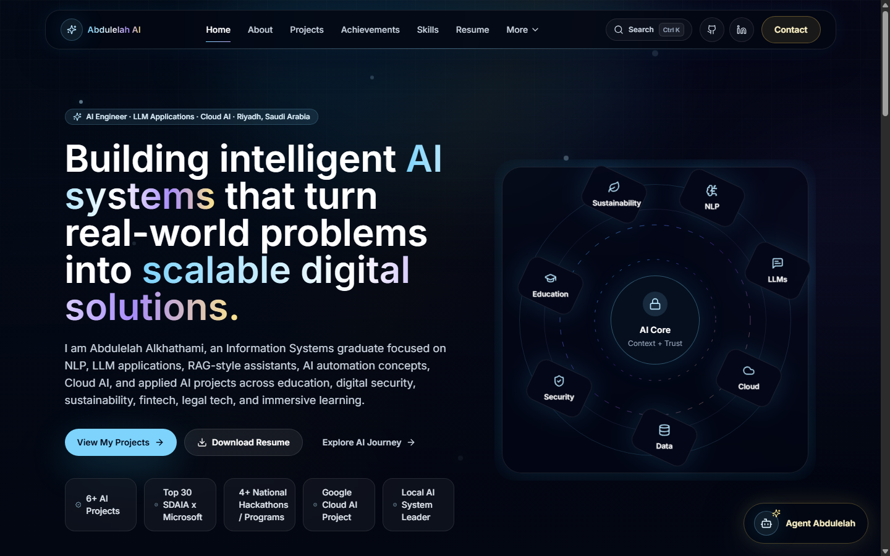

<picture>
  <source media="(max-width: 600px)" srcset="assets/branding/hero-mobile.svg">
  
</picture>

# Abdulelah.de · Bilingual AI Portfolio

A bilingual portfolio where the pages and the embedded assistant answer from the same typed source of facts, so what a visitor reads and what the assistant says cannot drift apart.

**Status: deployed product.** Live at [abdulelah.de](https://www.abdulelah.de).

## Problem

A portfolio and a chatbot bolted onto it usually disagree. The site says one thing, the assistant improvises another, and the visitor cannot tell which to trust. Meanwhile a recruiter has a narrow question — what did he actually build, and can I see it — and needs an answer in under a minute.

## Solution

Every portfolio fact lives in typed data modules. Pages, project cards, SEO metadata, structured data and the assistant all read from those same modules, so the assistant is constrained by the content rather than free to invent around it. Server route handlers keep model and email integrations off the client.

## How it works

1. **One source of facts.** `data/site.ts` holds identity, links, SEO keywords, contact addresses and resume links; `data/projects.ts` holds project descriptions, role, technologies, features and impact copy.
2. **Pages render from it.** App Router pages and components compose those typed facts into the site.
3. **The assistant is constrained by it.** `lib/agent/*` maps recruiter and visitor questions into portfolio responses drawn from the same data.
4. **Integrations stay server-side.** `app/api/agent/*` and `app/api/contact/*` expose server-only behaviour; keys never reach the browser.
5. **Discoverability is generated, not hand-kept.** Sitemap, robots, JSON-LD and Open Graph assets derive from the same content.

## Architecture

```text
Browser
  -> Next.js App Router pages
  -> Server route handlers for contact and agent APIs
  -> Portfolio data modules in /data
  -> Agent logic in /lib/agent
  -> Optional external services: DeepSeek API, Resend, Vercel Analytics
```

## Verified capabilities

- AI-engineer homepage with proof-oriented project positioning
- Project case-study pages for ChatUB, Althil, Absher Insight AI, Qanouni, Medad and Virtual Astronauts
- Role-specific resume downloads for AI Engineer and AI Specialist paths
- Agent Abdulelah, an embedded portfolio assistant with recruiter-mode responses
- Blog and Arabic blog content on AI agents, university AI, cloud AI and responsible AI UX
- SEO metadata, JSON-LD structured data, sitemap, robots and Open Graph assets
- Responsive dark interface with reduced-motion handling and mobile navigation
- Contact route with email delivery via Resend when configured

## Screenshot



Captured from the live portfolio homepage.

## Tech stack

Next.js 16 App Router · React 18 · TypeScript · Tailwind CSS · Framer Motion · Radix UI primitives · lucide-react · Vercel Analytics · Resend · DeepSeek-compatible chat completion API

## Quick start

```bash
npm install
cp .env.example .env.local
npm run dev
```

Open `http://localhost:3000`. Other scripts:

```bash
npm run lint
npm run build
npm run start
```

Optional environment variables:

```bash
DEEPSEEK_API_KEY=
DEEPSEEK_MODEL=deepseek-v4-flash
RESEND_API_KEY=
CONTACT_TO_EMAIL=me@abdulelah.de
CONTACT_FROM_EMAIL="Portfolio Contact <onboarding@resend.dev>"
NEXT_PUBLIC_SITE_URL=https://www.abdulelah.de
```

The assistant and contact delivery are optional: without keys the site runs, and those routes degrade rather than break.

## Limitations

- **Screenshot coverage.** Project pages still need per-project captures and architecture diagrams.
- **Test coverage.** No end-to-end tests yet for navigation, resume downloads, contact validation or assistant open/close behaviour.
- **Link checking.** External project, GitHub, LinkedIn and resume URLs are not yet checked automatically.

## Repository structure

```text
app/                 App Router pages, API routes, sitemap, robots, errors
components/          Layout, sections, project UI, agent UI, shared controls
data/                Portfolio facts, projects, skills, achievements, blog data
lib/                 Metadata, structured data, contact, rate limit, agent logic
public/              Open Graph images, profile assets, fonts, resume PDFs
types/               Shared TypeScript types
```

## Documentation

[Architecture](docs/architecture.md) · [Case study](docs/case-study.md) · [Engineering principles](docs/engineering-principles.md) · [Technical decisions](docs/technical-decisions.md) · [Reviewer guide](docs/reviewer-guide.md) · [Branding assets](assets/branding/README.md)

## License

No license file is currently present. All rights are reserved by default unless a license is added.

## Contact

**Abdulelah Alkhathami** · [Portfolio](https://abdulelah.de) · [GitHub](https://github.com/Abdulel3h) · [Email](mailto:me@abdulelah.de)
