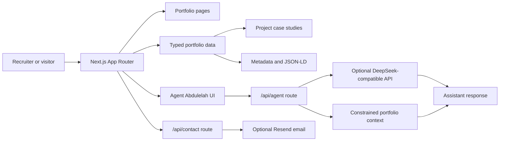

# Abdulelah AI Portfolio Architecture

The portfolio site is designed as a unified AI Engineer presentation system: public website, structured project data, role-specific resumes, blog content, and an embedded portfolio assistant.

## System Flow

## Key Design Decisions

- Keep identity, projects, skills, achievements, and links in typed data modules.
- Make project pages, SEO metadata, and assistant responses draw from the same factual portfolio source.
- Keep the assistant constrained to portfolio context instead of acting like a general chatbot.
- Treat role-specific resumes and recruiter flows as first-class portfolio features.

## Production Gaps

- Add automated link checks for profile, project, resume, GitHub, LinkedIn, and demo URLs.
- Add e2e tests for navigation, assistant open/close behavior, and resume downloads.
- Add real project screenshots and architecture diagrams to each project page.
- Add a public changelog for portfolio maintenance history.
